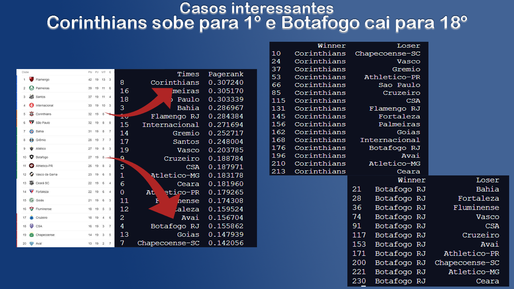
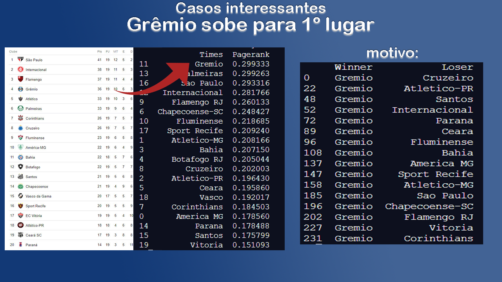

# AL-A2-Pagerank
Trabalho sobre o Algoritmo do Pagerank no contexto da Álgebra Linear para a disciplina Álgebra Linear - 2020.2

## Alunos

> ↳ [Erick Brito](https://github.com/Erickslb)  
> ↳ [Germano Andrade](https://github.com/GermanoAndrade)

## Introdução

Este trabalho visa a mostrar o funcionamento do algoritmo do Pagerank do ponto
de vista da Álgebra Linear. Pretende-se introduzir a metodologia por trás do
algoritmo e também aplicações em base de dados reais.

## Teoria

A explicação da teoria do funcionamento do algoritmo do Pagerank é explicada
no [relatório](./Relatório%20-%20Pagerank.pdf) do trabalho.

## Aplicação em uma Base de Dados

A base escolhida trata sobre o 
[Campeonato Brasileiro de Futebol](https://www.kaggle.com/gabrielmeireles/brazilian-football-championship) 
das temporadas de 2013 a 2020. Ela contém todas as partidas realizadas e, dentre outros dados,
os nomes dos times, data da partida, ano, total de gols de cada time, vencedor da
partida, etc.

As bibliotecas usadas foram `numpy` e `pandas` no python.

Após o devido pré-processamento na base para poder aplicar o algoritmo, tivemos os seguintes resultados interessantes:

	

 

Podemos ver que a tabela sofre grande alteração de posições quando considerada
pelo pagerank. 

Nesse outro caso, podemos observar que uma sequência de bons resultados contra times
bem posicionados renderia uma ascensão à liderança do campeonato ao Grêmio:

	

 
